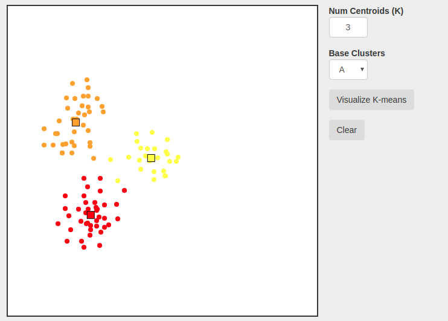

# Javascript-K-Means-Visual
An interactive visualization of the K-Means clustering algorithm in Javascript.

## About
k-means clustering is a method of vector quantization that is popular for cluster analysis in data mining. It is an unsupervised learning algorithm. k-means clustering involves partitioning n observations into k clusters in which each observation belongs to the cluster with the nearest mean, serving as a prototype of the cluster.
## Usage
Simply choose a value for k, pick from a menu of preset clusters or click to draw your own vectors, and click the visualize button.
<br/>
<br/>


## Run with parcel:
```bash  
$ npm install -g parcel-bundler
$ npm init -y
$ parcel index.html
    
Server running at http://localhost:1234 
✨  Built in 70ms.
